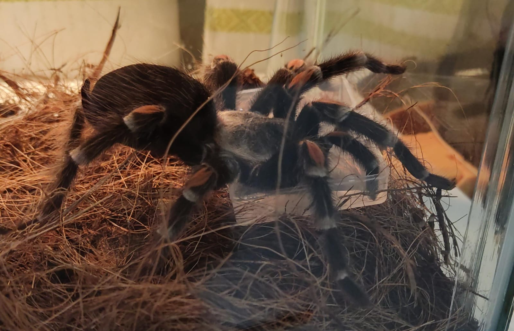

# Spider robot leg trajectory as a bilevel optimization problem
The main objective of this project is to biomimicry the movement of the spiders legs by implementing a reference based software, where the reference signal, that replicates the motion of an arachnid, generates optimal Bézier polynomials for the trajectories.

To compute the optimal trajectories, a genetic algorithm is used to solve a bilevel problem, where the upper level corresponds to the number of polynomials required to emulate the biological motion and the lower level corresponds to the optimization of the parameters for each polynomial.

The performance function of the upper level considers the computational cost, in order to minimize the resources required in the implementation of the trajectory generator. 
The optimized trajectory generator is evaluated on the spider robot, then implemented in a simulated environment to guarantee that the resulting trajectories are feasible.

This is "Refineria" is a Mexican Flame Knee tarantula Brachypelma Auratum

It is our test subject, from it we will obtain the movement trajectories of its legs.

## How can we make it possible?

Thanks to the contrast of coloration in their joints we can use software such as Tracker to obtain their movement trajectories.
